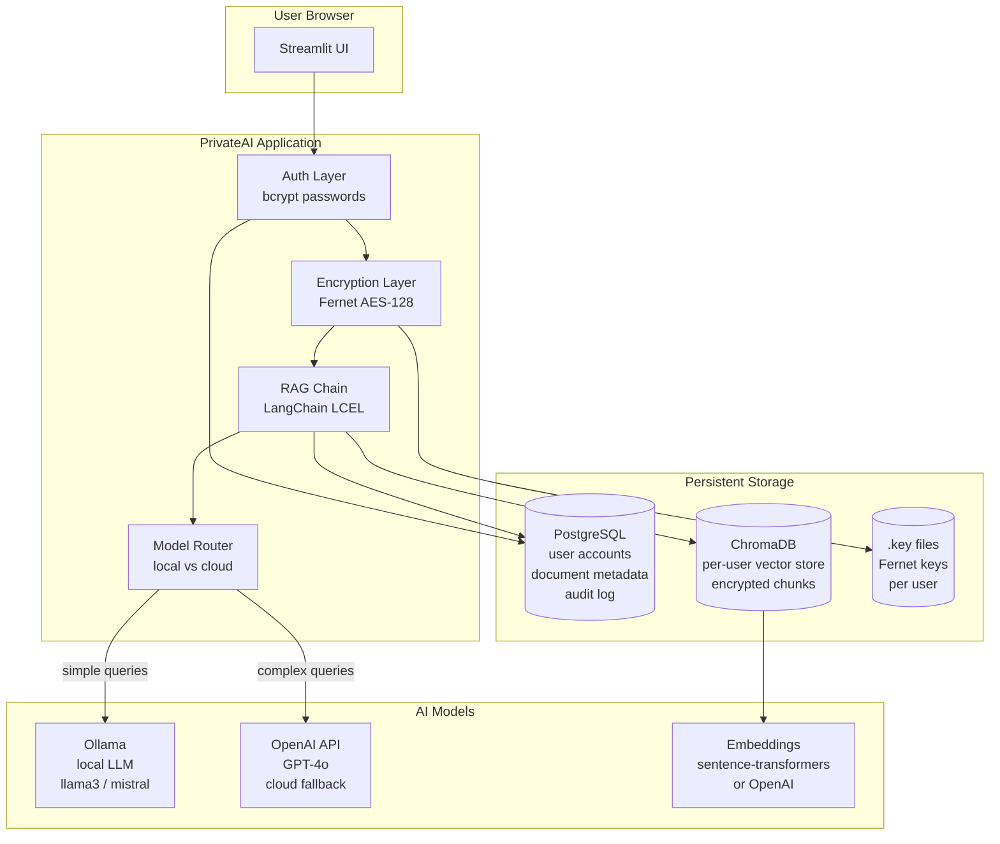
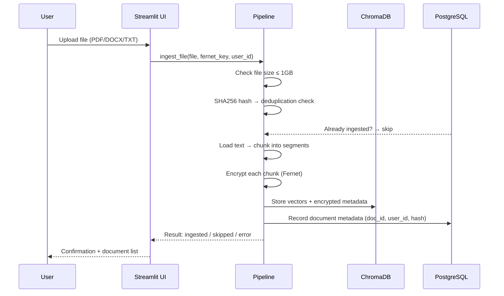
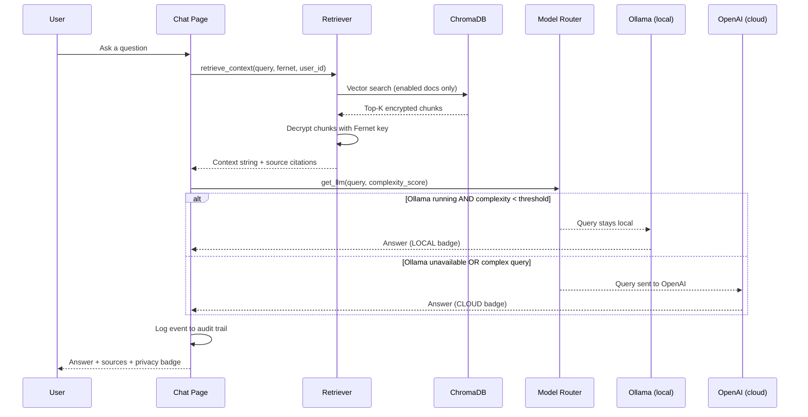
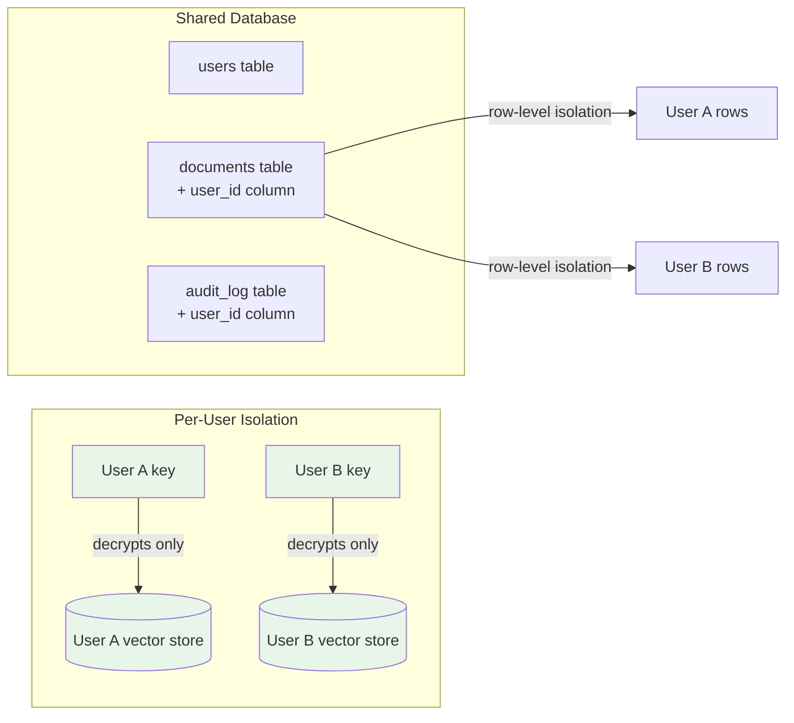

# PrivateAI — Private AI Agent Platform

**Chat with your own documents. Your data never leaves your control.**

[](https://python.org)
[](https://streamlit.io)
[](https://langchain.com)
[](https://railway.app)

---

## The Problem

**95% of professionals have documents they can't put into ChatGPT.**

Medical records, legal contracts, financial reports, proprietary research, HR files, client data — all of it is off-limits for most AI tools because of a single fundamental design flaw: **your data goes to someone else's server**.

The market for enterprise AI document tools is **$4.4B and growing at 28% annually** (Grand View Research, 2024), yet most solutions require organizations to trust a third party with their most sensitive information. Regulated industries (healthcare, finance, legal, government) are effectively locked out entirely.

This creates a gap: powerful AI for documents, with **zero data exposure**.

---

## The Solution

PrivateAI is a **privacy-first RAG (Retrieval-Augmented Generation) platform** that lets you upload documents and have an AI conversation with them — with military-grade encryption at every layer.

**What makes it different:**

| Feature | ChatGPT / Claude | PrivateAI |
|---|---|---|
| Document stays on your server | ✗ | ✅ |
| Encrypted at rest | ✗ | ✅ (Fernet AES-128) |
| Per-user key isolation | ✗ | ✅ |
| Audit trail of every query | ✗ | ✅ |
| Runs fully offline | ✗ | ✅ (with Ollama) |
| Open source | ✗ | ✅ |

---

## Potential Outcomes

- **Healthcare:** Clinicians query patient records, lab results, and research literature without violating HIPAA.
- **Legal:** Associates query case files and contracts without privileged data leaving the firm.
- **Finance:** Analysts query earnings reports and internal memos without SEC disclosure concerns.
- **Government:** Analysts query classified or sensitive documents on air-gapped infrastructure.
- **Enterprise:** Any team that needs AI on internal documentation without an IT security exception.

---

## Architecture

### System Overview



### Document Ingestion Flow



### RAG Query Flow



### Security Model



---

## How Your Data Is Secured

### 1. Encryption at Rest
Every document chunk is encrypted with **Fernet** (AES-128-CBC + HMAC-SHA256) before being stored. The vector store contains only numerical embeddings — never your actual text.

### 2. Per-User Key Isolation
Each user generates their own encryption key on their device. The key is stored only:
- In the user's browser session (cleared on logout)
- In a `.key` file in the user's private data directory on the server

**No one — including the server operator — can read User A's documents with User B's key.**

### 3. 12-Word Recovery Phrase
Each key is deterministically derived from a 12-word BIP39-style mnemonic phrase. The phrase is shown once during setup and never stored digitally. It is the only way to recover data if the key file is lost.

### 4. Hybrid AI Routing with Privacy Awareness
PrivateAI scores each query for complexity and routes accordingly:

```
Complexity Score < Threshold → Ollama (local, private, free)
Complexity Score ≥ Threshold → OpenAI GPT-4o (cloud, more capable)
```

The UI always shows a **LOCAL** or **CLOUD** badge on every response so you know exactly where your query went. The audit log captures every event.

### 5. Multi-Tenant Database Isolation
All database tables include a `user_id` column. Every query is scoped by `user_id` — there is no shared data between accounts. An admin can see user account records but cannot access encrypted document content.

### 6. Upload Size Limit
File uploads are capped at **1 GB per file** to prevent resource exhaustion.

---

## Why This Architecture

| Choice | Rationale |
|---|---|
| **Streamlit** | Fastest path to a production-quality data app without a separate frontend. Ideal for AI tooling. |
| **LangChain LCEL** | Composable chain definition — easy to swap LLM, retriever, or parser without rewriting logic. |
| **ChromaDB** | Embedded vector store — no extra service required locally, simple to persist on a volume in production. |
| **Fernet encryption** | Symmetric encryption with built-in authentication (HMAC). Simple, audited, no key management service needed. |
| **Hybrid routing (Ollama + OpenAI)** | Maximizes privacy (local first) while maintaining quality for complex queries. Users control the threshold. |
| **PostgreSQL on Railway** | Durable, scalable, free tier available. SQLite fallback means zero friction for local dev. |
| **sentence-transformers** | Local embedding model (~90MB) — documents can be indexed without any external API call. |

---

## Quick Start — Local Development

### Prerequisites
- Python 3.11+
- [Ollama](https://ollama.com) (optional — enables local-only mode)

### 1. Clone and install

```bash
git clone https://github.com/virtualryder/private-ai.git
cd private-ai
python -m venv .venv
source .venv/bin/activate      # Windows: .venv\Scripts\activate
pip install -r requirements.txt
```

### 2. Configure environment

```bash
cp .env.example .env
# Edit .env — at minimum add your OPENAI_API_KEY if you want cloud fallback
```

### 3. (Optional) Start Ollama

```bash
ollama pull llama3
ollama serve
```

### 4. Run the app

```bash
streamlit run app.py
```

Open [http://localhost:8501](http://localhost:8501). Create your first account — it will automatically become the admin.

---

## Quick Start — Docker Compose (Full Stack)

Runs PostgreSQL + Ollama + PrivateAI in one command:

```bash
cp .env.example .env
# Add OPENAI_API_KEY to .env
docker compose up --build
```

Then open [http://localhost:8501](http://localhost:8501).

---

## Deploy to Railway

### Step 1 — Fork and create project

1. Fork this repo to your GitHub account
2. Go to [railway.app](https://railway.app) → **New Project**
3. Select **Deploy from GitHub repo** → pick your fork

### Step 2 — Add PostgreSQL

In your Railway project → **New Service → Database → PostgreSQL**

Railway will automatically create a `DATABASE_URL` variable available to your app.

### Step 3 — Set environment variables

In your PrivateAI service → **Variables**:

| Variable | Value |
|---|---|
| `DATABASE_URL` | Auto-populated from PostgreSQL service |
| `OPENAI_API_KEY` | Your OpenAI API key |
| `DATA_DIR` | `/app/data` |

### Step 4 — Create a Volume

In your PrivateAI service → **Volumes** → create a volume mounted at `/app/data`.

This persists:
- `data/users/{user_id}/.key` — Fernet encryption keys
- `data/users/{user_id}/vector_store/` — ChromaDB vector stores
- `data/users/{user_id}/uploads/` — Temporary upload staging

### Step 5 — Deploy

Click **Deploy**. Railway builds the Dockerfile and starts the app. First startup downloads the sentence-transformers model (~90MB) — this takes ~60 seconds.

---

## Running Tests

```bash
pip install pytest
pytest tests/ -v
```

### Test coverage

```
tests/test_crypto.py     — Fernet key generation, encrypt/decrypt, recovery phrase (7 tests)
tests/test_ingestion.py  — File loading, chunking, pipeline (6 tests)
tests/test_router.py     — Model routing logic, complexity scoring (8 tests)
```

---

## Project Structure

```
private-ai/
├── app.py                    # Entry point — auth gate, sidebar, page routing
├── core/
│   ├── database.py           # DB layer — PostgreSQL (prod) / SQLite (local)
│   ├── auth.py               # User accounts — bcrypt password hashing
│   ├── crypto.py             # Fernet encryption + BIP39 recovery phrases
│   ├── embeddings.py         # Embedding provider (local sentence-transformers / OpenAI)
│   ├── model_router.py       # Hybrid routing — Ollama vs OpenAI
│   ├── audit.py              # Audit event logger
│   └── user_paths.py         # Per-user filesystem paths
├── pages/
│   ├── auth.py               # Login / signup page
│   ├── onboarding.py         # Key generation / restore
│   ├── ingestion_ui.py       # Document upload and knowledge base management
│   ├── chat.py               # Conversational RAG interface
│   ├── settings.py           # Model config, routing threshold, audit log
│   └── admin.py              # Admin panel — user management
├── ingestion/
│   ├── pipeline.py           # Upload → chunk → encrypt → embed → store
│   ├── loader.py             # PDF, DOCX, TXT file loaders
│   └── chunker.py            # Overlapping text chunker
├── rag/
│   ├── chain.py              # LangChain LCEL RAG chain
│   └── retriever.py          # ChromaDB retrieval + Fernet decryption
├── config/
│   ├── settings.yaml         # Default model settings
│   └── permissions.yaml      # Agent permission flags
├── tests/                    # pytest test suite
├── Dockerfile                # Production container
├── docker-compose.yml        # Local dev stack (PostgreSQL + Ollama + app)
├── railway.toml              # Railway deployment config
└── .env.example              # Environment variable template
```

---

## Security Disclosure

If you discover a security vulnerability, please open a GitHub issue marked **[SECURITY]** or email directly. Do not post exploit details publicly before a fix is available.

---

## License

MIT License. See [LICENSE](LICENSE) for details.
